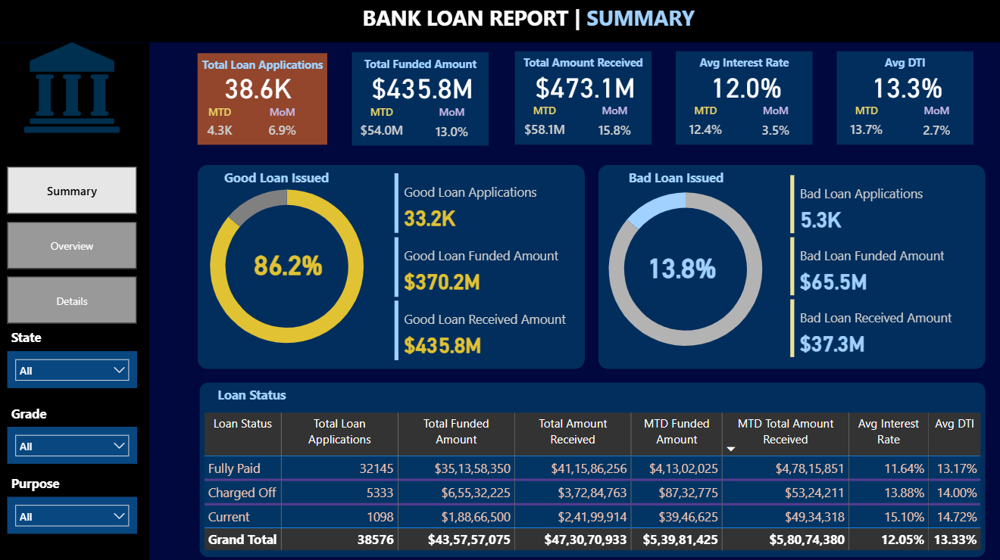
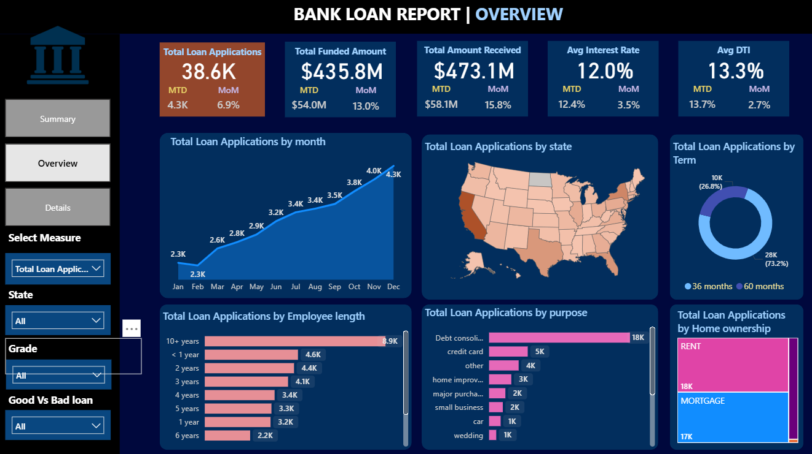
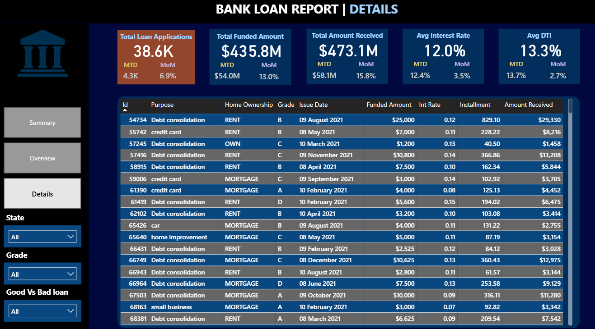

# Bank Loan Portfolio Analysis & Power BI Dashboard

An end-to-end data analytics project analyzing a bank loan portfolio using **Excel, MySQL, and Power BI**.

The project focuses on understanding loan applications, funded amounts, borrower repayment behavior, loan performance, and portfolio trends through SQL analysis and an interactive Power BI dashboard.

---

## 📌 Project Overview

The objective of this project is to analyze a bank's loan portfolio and provide a consolidated view of lending performance.

The analysis covers:

- Loan application volume
- Funded loan amounts
- Amount received from borrowers
- Good vs Bad loan performance
- Loan status distribution
- Interest rate and DTI analysis
- Monthly lending trends
- State-wise loan applications
- Loan term distribution
- Employment length
- Loan purpose
- Home ownership
- Detailed loan-level information

The final solution consists of **SQL-based analysis and an interactive Power BI dashboard** containing Summary, Overview, and Details pages.

---

## 🎯 Business Problem

The bank needs a data-driven view of its loan portfolio to understand:

1. How many loan applications are being received?
2. How much money is being funded through loans?
3. How much amount is being received from borrowers?
4. How are loan applications distributed across different loan statuses?
5. What proportion of loans are performing well versus charged off?
6. How do lending activities change over time?
7. Which states, loan purposes, employment groups, and home ownership categories contribute to loan applications?
8. How do key portfolio metrics change on a Month-to-Date and Month-over-Month basis?

---

## 🎯 Project Objectives

- Calculate core loan portfolio KPIs.
- Analyze MTD and MoM performance.
- Compare Good Loans and Bad Loans.
- Analyze loan status distribution.
- Identify monthly and regional lending trends.
- Understand borrower and loan characteristics.
- Build an interactive Power BI dashboard for portfolio monitoring.
- Provide actionable business insights from the analysis.

---

## 🗂️ Dataset

The dataset contains **38,576 loan records and 24 attributes**.

### Key Attributes

| Attribute | Description |
|---|---|
| `id` | Unique loan identifier |
| `member_id` | Unique borrower/member identifier |
| `address_state` | Borrower's state |
| `application_type` | Type of loan application |
| `emp_length` | Borrower's employment length |
| `emp_title` | Employer/job title |
| `grade` | Loan risk/credit grade |
| `sub_grade` | Detailed loan grade |
| `home_ownership` | Borrower's home ownership status |
| `issue_date` | Loan issue/origination date |
| `loan_status` | Current status of the loan |
| `purpose` | Purpose of the loan |
| `term` | Loan repayment duration |
| `verification_status` | Borrower information verification status |
| `annual_income` | Annual borrower income |
| `dti` | Debt-to-Income ratio |
| `installment` | Scheduled monthly installment |
| `int_rate` | Loan interest rate |
| `loan_amount` | Loan amount |
| `total_acc` | Total credit accounts |
| `total_payment` | Total payment received |

---

## 🧹 Data Cleaning & Preparation

Initial data quality checks were performed before analysis.

### Cleaning performed:

- Checked for duplicate records.
- Verified uniqueness of loan IDs and member IDs.
- Validated date fields.
- Standardized the `term` field by removing leading/trailing spaces.
- Audited missing values.
- Retained missing employer title values where applicable instead of removing records.
- No unnecessary rows or columns were removed.
- No financial values were manually altered.

Excel was used primarily for **data cleaning and validation** before SQL and Power BI analysis.

---

## 🛠️ Tools & Technologies

- **Excel** — Data cleaning and validation
- **MySQL** — SQL analysis and KPI calculations
- **Power BI** — Interactive dashboard and visualization
- **DAX** — Measures, MTD, PMTD, MoM and portfolio KPIs
- **Power Query** — Data preparation and transformation

---

# 📊 SQL Analysis

SQL was used to calculate and validate the major portfolio KPIs and analytical metrics.

### Key SQL Analysis

- Total Loan Applications
- Total Funded Amount
- Total Amount Received
- Average Interest Rate
- Average DTI
- Month-to-Date metrics
- Previous Month-to-Date metrics
- Month-over-Month changes
- Good Loan Applications
- Good Loan Funded Amount
- Good Loan Received Amount
- Bad Loan Applications
- Bad Loan Funded Amount
- Bad Loan Received Amount
- Loan Status analysis
- Monthly analysis
- State-wise analysis
- Loan term analysis
- Employment length analysis
- Loan purpose analysis
- Home ownership analysis

The SQL queries are available in:

`Bank_Loan_Analysis_sql`

---

# 📈 Power BI Dashboard

The Power BI solution contains three dashboard pages:

## 1. Summary Dashboard

Provides a high-level view of the loan portfolio.

### KPIs

- Total Loan Applications
- Total Funded Amount
- Total Amount Received
- Average Interest Rate
- Average DTI
- MTD performance
- MoM changes

### Good vs Bad Loan Analysis

The dashboard compares:

- Good Loan Applications
- Good Loan Funded Amount
- Good Loan Received Amount
- Bad Loan Applications
- Bad Loan Funded Amount
- Bad Loan Received Amount

For this analysis:

**Good Loans = Fully Paid + Current**

**Bad Loans = Charged Off**

---

## 2. Overview Dashboard

The Overview page provides visual analysis of loan applications across different dimensions.

### Visualizations

- Monthly Loan Application Trend
- State-wise Loan Applications
- Loan Term Distribution
- Employment Length Analysis
- Loan Purpose Analysis
- Home Ownership Analysis

The dashboard also provides slicers for interactive filtering by:

- State
- Grade
- Good vs Bad Loan

---

## 3. Details Dashboard

The Details page provides a detailed loan-level view.

It includes information such as:

- Loan ID
- Loan Purpose
- Home Ownership
- Grade
- Issue Date
- Funded Amount
- Interest Rate
- Installment
- Amount Received

This allows users to move from portfolio-level KPIs to individual loan records.

---

# 🧮 DAX & Time Intelligence

DAX measures were created for portfolio KPIs and time-based analysis.

### Example measures include:

- Total Loan Applications
- Total Funded Amount
- Total Amount Received
- Average Interest Rate
- Average DTI
- MTD Total Loan Applications
- MTD Total Funded Amount
- MTD Total Amount Received
- Previous MTD metrics
- MoM percentage changes

A dedicated Date Table was used for time-intelligence calculations.

---

# 🔍 Key Insights

The analysis produced several important portfolio-level observations.

### Portfolio Performance

- The dataset contains **38.6K loan applications**.
- Total funded amount is approximately **$435.8M**.
- Total amount received is approximately **$473.1M**.
- The overall average interest rate is approximately **12.0%**.
- The overall average DTI is approximately **13.3%**.

### Good vs Bad Loans

- Approximately **86.2%** of loan applications fall under Good Loans.
- Approximately **13.8%** fall under Bad Loans.
- Good Loans account for approximately **$370.2M** in funded amount.
- Bad Loans account for approximately **$65.5M** in funded amount.

### Loan Status

The portfolio contains three major loan statuses:

- Fully Paid
- Charged Off
- Current

Fully Paid loans represent the largest portion of applications in the dataset.

### Lending Trends

Monthly analysis shows changes in loan application volume throughout the available loan issue period, allowing the bank to monitor growth and fluctuations in lending activity.

### Loan Characteristics

The dashboard also highlights differences in loan applications based on:

- Loan term
- Employment length
- Loan purpose
- Home ownership
- Geographic location

---

# 💡 Business Recommendations

Based on the analysis, the bank can:

1. Monitor **Bad Loan percentage** and charged-off loans regularly.
2. Track **MTD and MoM changes** to identify changes in lending activity.
3. Analyze loan performance across different **grades and borrower segments**.
4. Monitor high-volume **loan purposes** to understand where lending demand is concentrated.
5. Compare regional lending activity to understand state-wise portfolio distribution.
6. Track funded versus received amounts to monitor repayment performance.
7. Use the Details dashboard to drill down into individual loans when investigating portfolio trends.

---

# 📁 Project Files

| File | Description |
|---|---|
| `Bank Loan Dashboard.pbix` | Power BI dashboard |
| `Bank_Loan_Analysis_sql` | SQL queries used for analysis |
| `Bank_Loan_SQL.docx` | SQL query documentation |
| `Dashboard_summary.png` | Summary dashboard screenshot |
| `Dashboard_overview.png` | Overview dashboard screenshot |
| `Dashboard_details.png` | Details dashboard screenshot |

---

# 📸 Dashboard Preview

## Summary

## Overview

## Details

---

# 🚀 Skills Demonstrated

### Data Analytics
- Data Cleaning
- Data Validation
- Exploratory Data Analysis
- KPI Analysis
- Business Insights

### SQL
- Aggregations
- GROUP BY
- CASE statements
- Date-based analysis
- Conditional calculations
- KPI validation
- Time-based analysis

### Power BI
- Data Modeling
- Power Query
- DAX
- Time Intelligence
- Interactive Slicers
- KPI Cards
- Drill-down analysis
- Dashboard Design
- Data Visualization

### Excel
- Data Quality Checks
- Text Cleaning
- Missing Value Audit
- Duplicate Checks
- Data Validation

---

# 📌 Project Outcome

This project demonstrates an end-to-end analytics workflow:

**Raw Loan Data → Excel Cleaning → MySQL Analysis → DAX Measures → Power BI Dashboard → Business Insights**

The final dashboard enables users to monitor loan portfolio performance, understand borrower and loan characteristics, compare Good and Bad Loans, and drill down into detailed loan-level information.
